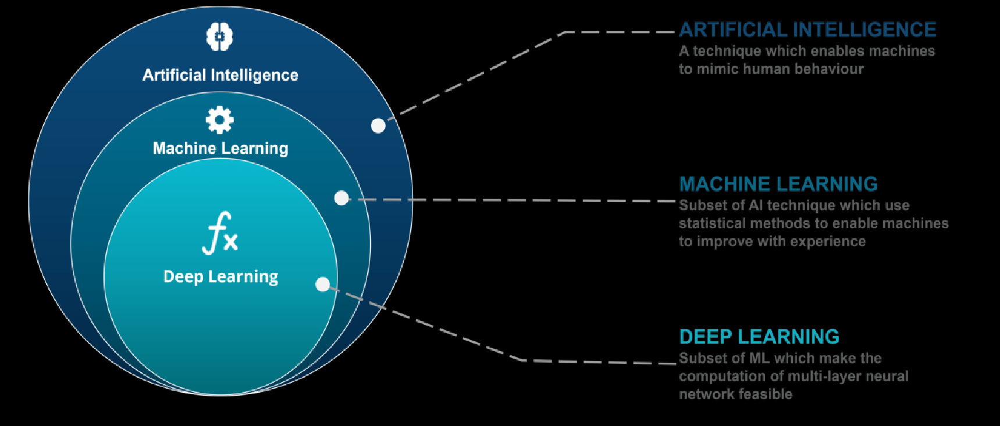

# Artificial Intelligence VS Machine Learning VS Deep Learning

**Artificial Intelligence:** It deal with building complex systems that intimate, intelligent human behavior, for example a self driven cars - It have sensors to capture the images. Those images goes to the Machine Learning model hat might be using something called as deep learning models to detect where is the obstacles and in what way the car should move ahead.

It's doing multiple things - It's a complex system which includes Planning, Object detection, NLP, machine Learning, deep learning and other stuff.

**Machine Learning:** It is a subset of AI. Here, we build Algorithms that can learn and improve from experiences. basically, we feed some data to the ML model. the model is going to learn from that data and it's going better and better at performing certain task. For example a weather forecast or wan to predict the price of the house.

**Deep Learning:** It's subset and a specialized area  in machine Learning where we build more complex models based on the idea of neural networks. for example - classifying images or detecting where the object is present
