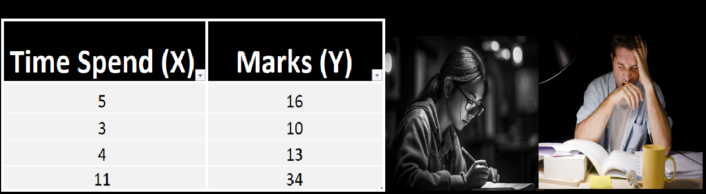
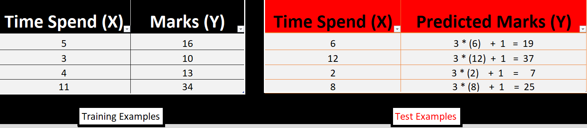
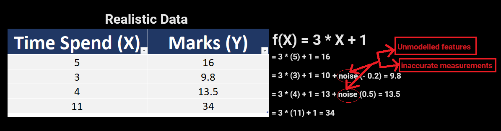
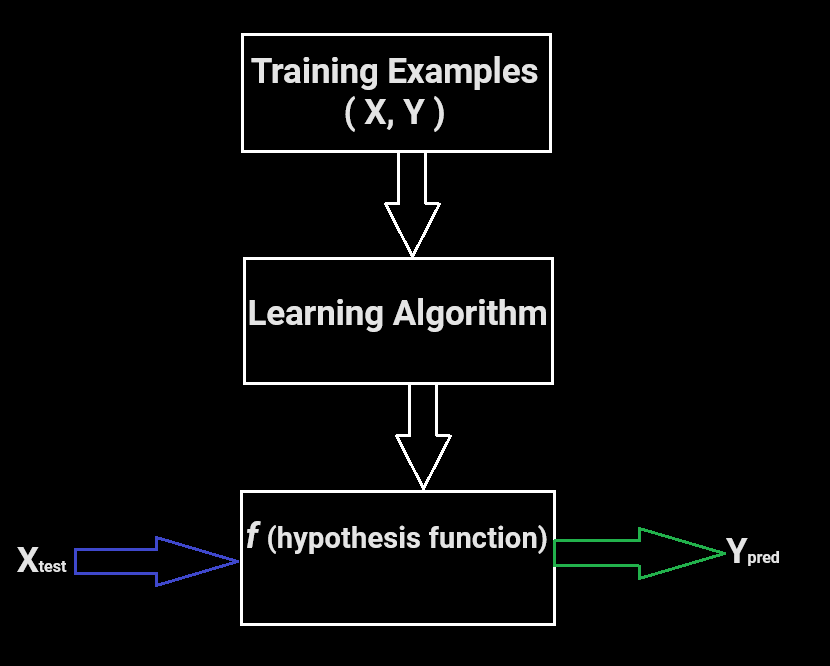

# Supervised Learning

- In supervised learning, we use labeled datasets (training examples and their associated correct labels) to train algorithms that to classify data (or) predict outcomes accurately.
- **Regression** and **Classification** are two tasks of supervised learning.
- **Regression:**  Predict a **countinuous numeric value,** example how much that house sell for? predicting house prices.
- **Classification:** Assign a label, Is this a Dog or cat or human and of what breed?

Example:

Let's examine the problem of predicting student's marks based upon number of hours student has put in studying before the exam.

**Solution:** Let's out to find a common pattern or comman function, f(X) which gives us the value of Y.

f(X) = y Hence, if f(5) = 15,

 f(3) = 10,

f(4) = 13 and

f(11) = 34 then,

the **f(X) = 3 * X + 1** is the fuction w.r.t to X so, y = 3 * X + 1

**Approach:** The data is split into a training dataset and test dataset. The training set has labels, so your model can learn from these labeled examples.

The test set does not have labels, i,e., you don'y yet know the value you're trying to predict.

It's important that your model can generalize to situations it hasn't encountered before so that it can perform well on the test data.

Training Dataset = 80% of dataset + labels - It is from training the model (algorithm)

Test Dataset        = 20% of dataset (without labels) - It is to evaluate the model

But in realistic data, we not get the accurate prediction means our prediction is moreover approximation rather than accurate value.

We would like to build a model that approximates the relationship ***f***  between number of hours **X** and marks scored **Y**.

> **Y = *f* ( X ) + ε**

- **X ( input )     -** number of hours of study
- **Y ( output )   -** marks scored
- ***f* ( function ) -** describing the relationship between X and Y.
- **ε (epsilon)     -**  random error with zero mean to account for unmodeled features/inherent noise in the data.

Therefore, In supervised learning, the machine attempts to learn the relationship between X and Y, by running labeled training data through a learning algorithm.

