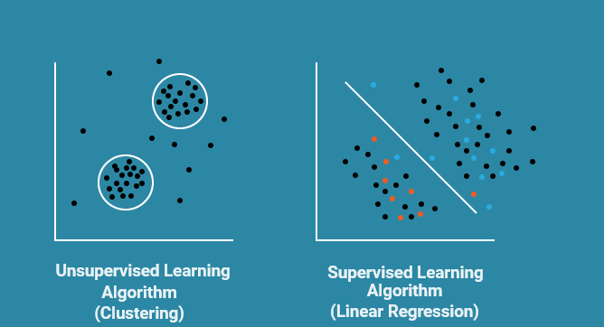

# Unsupervised Learning

- The goal of unsupervised learning to find underlying data structure of the dataset, or how to group the data in most useful cases, starting with a **unlabelled dataset**.
- The two unsupervised learning techniques we will explore are **clustering** the data into groups by similarity and **reducing dimensionality** to compress the data while maintaining its structure and usefulness.

These task are helpful in doing the **Exploratory Data Analysis ( EDA )**, customer segmentation, grouping similar images etc.,

**Clustering**

* The goal of clustering is to create groups of data points such that points in **different clusters are dissimilar while points within a cluster are similar**.

**Techniques**

1. K-Means Clustering,
2. Hierarchical Clustering

**Exampes**

- Google Photos wants to cluster similar looking faces under one person category.
- Clustering news articles related to one topic under one heading.
- An advertising platform segments the population into smaller groups with similar purchasing habits so that advertisers can reach their target market.

**Dimensionality Reduction**

- This is about trying to reduce the complexity of the data while keeping as much of the relevant structure as possible. If you take a simple 128 x 128 x 3 pixels image ( length x width x RGB value ), that's 49, 152 dimensions of data.
- If you're able to reduce the dimensionality of the space in which these images live without destroying too much of the meaningful content in the images, then you've done a good job at dimensionality reduction.

We often need reducing number of dimensions in a larger data set to simplify models.

**Techniques**

1. Principle Component Analysis (PCA),
2. Singular value decomposition,
3. T-SNE,
4. Deep Learning Techniques - Autoencoder
