# Linear Regression

- Linear Regression is also known as **Ordinary Least Squares.**
- Regression predicts a **countinuous value**. Now we will build an algorithm that solves the task of predicting marks given a labelled dataset.
- The goal of the algorithm is to learn a **linear model** that predicts a ***y** for an unseen **x** with minimum error*.

  **Input (X) :** It is the independent feature or **input feature** which is **Time Spent**.

  **Output (Y) :** It is the dependent feature (or) the **target** variable which is **Marks**.


#### Equation of Line: Y = m * x + c

where, m is the slope, c is the intercept and x is the coefficient.

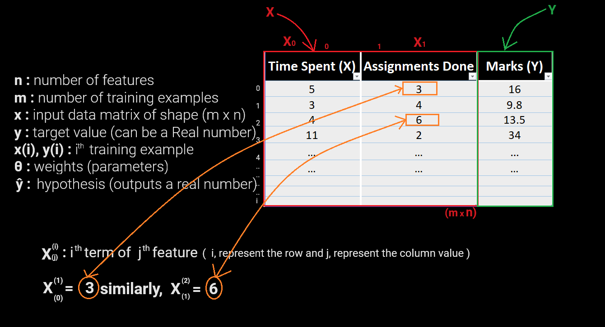

## Hypothesis

**Step 1: Assume a Hypothesis function**

- Linear Regression is a **parametric method**, which means it makes an assumption about the form of the function relating X and Y. So, we decide to approximate **y** as a linear function of **x**

  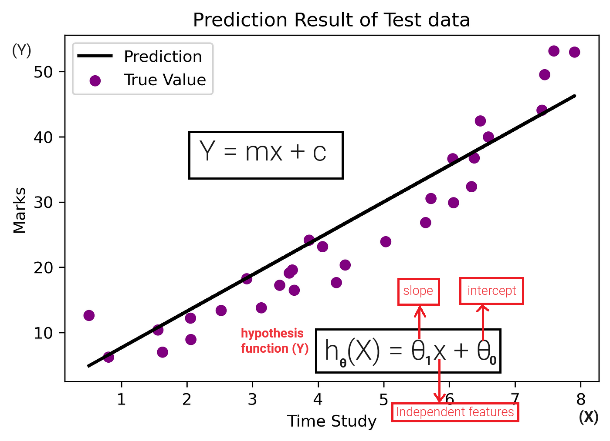

**Step 2: Decide Loss/Error Function**

- Given a training set. how do we learn, the best values for the parameters ***θ***, so we define an error function that measures for each value of ***θ*** how close the predictions are to the actual **y** values.

**Loss Function:** The loss function is a measure of how close we are to the true/target value or in general, it is a measure of how good the algorithm is doing. The lower the loss the better our predictions will be.

**J(***θ***) = $\frac{1}{2m} \Sigma_{i=1}^m ( {y}-\hat{y} )^2$**

(OR)

J($\Theta_{0}, \Theta_{1})$ = $\frac{1}{2m} \Sigma_{i=1}^m ( {y}^{i}-h_{\Theta}^{i}(x) )^2$

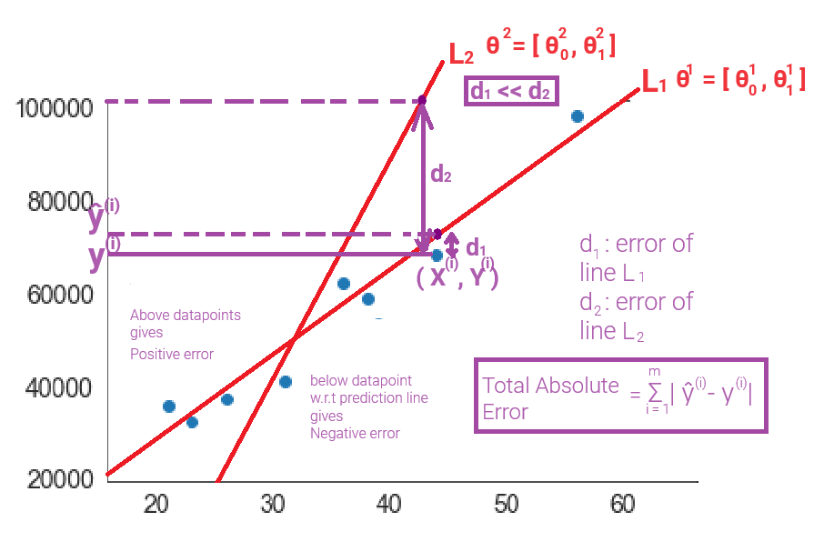

Here in above diagram we can see the Line L1 is better as compare to Line L2 because the distance/error/residual from actual datapoint from the prediction lines L1 & L2 is lesser in comparison.

**Absolute Error :** The absolute error, denoted as **|𝑦 − 𝑦̂|**, measures the absolute difference between the actual value **(𝑦)** and the predicted or estimated value **(𝑦̂)**. It quantifies the magnitude of the error without considering its direction. The formula for absolute error is: **∣𝑦−𝑦̂∣** and Total absolute error will be:

**Total Absolute error = $\Sigma_{i=1}^m  | {y}-\hat{y} |$**

**Sum of Squared Error (SSE) :** The Sum of Squared Error (SSE) is a metric used to quantify the overall discrepancy between the actual data points and the values predicted by a model. It is calculated by taking the sum of the squared differences between each actual data point and its corresponding predicted value. The formula for SSE can be expressed as:

**𝑆𝑆𝐸 = $\Sigma_{i=1}^m ( {y}-\hat{y} )^2$**

**Mean Square Error (MSE) :** The mean square error, often denoted as MSE, is a metric that calculates the average of the squares of the errors between the actual and predicted values. It is represented by the formula:

**𝑀𝑆𝐸 = $\frac{1}{m} \Sigma_{i=1}^m ( {y}-\hat{y} )^2$**

Here, m represents the number of data points, $ y_{i}$ denotes the actual values, and $\hat y_{i}$ represents the predicted values.

**We Prefer MSE Over Absolute Error:**

* **MSE penalizes larger errors more significantly** due to the squaring operation, providing a more accurate representation of the model's performance.

  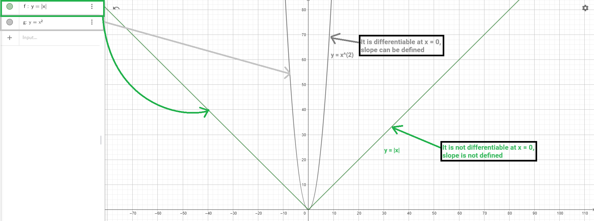
* It is "**differentiable"** and exhibits some desirable mathematical properties, making it convenient for optimization algorithms.

**Step 3: Training - an algorithm that reduces error on training data**

- Starting with a random $\Theta$, we need an algorithm that iteratively improves $\Theta$ by reducing $J(\Theta)$ in each step and converges eventually to minimum error.
- Task: find the parameters that minimize loss, i.e. make our model as accurate as possible.

### Gradient Descent

- The **gradient descent algorithm is an optimization technique used to minimize the cost function by iteratively adjusting the model parameters**.
- To efficiently perform this optimization, it requires the **cost function to be differentiable**.
- The differential function allows the algorithm to calculate the gradient, indicating the direction and magnitude of the steepest ascent or descent. Without a differentiable cost function, the algorithm cannot determine the appropriate direction for parameter updates, hindering its convergence towards the optimal solution.

  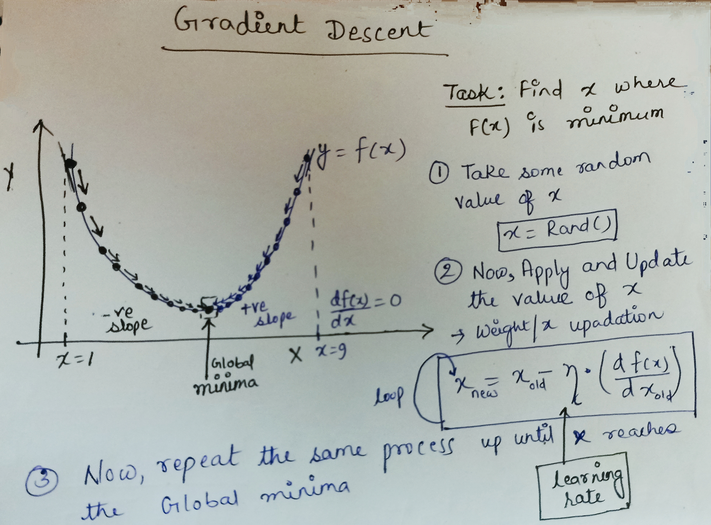
- MSE is preferred over absolute error due to **its enhanced sensitivity to larger errors and mathematical properties**, while a differential function is essential for the gradient descent algorithm to **iteratively optimize the model parameters** in a differentiable cost function.

Let's code Gradient Descent in python using a quadratic function

$y = f(x) = (x - 5)^2 + 3$

**Step 1: Import the necessary libraries**

```python
import numpy as np
import matplotlib.pyplot as plt
```

**Step 2: Get data for X and Y**

```python
# Generate data using a dummy function
X = np.arange(10)
Y = (X - 5)**2 + 3

print(X, Y)
```

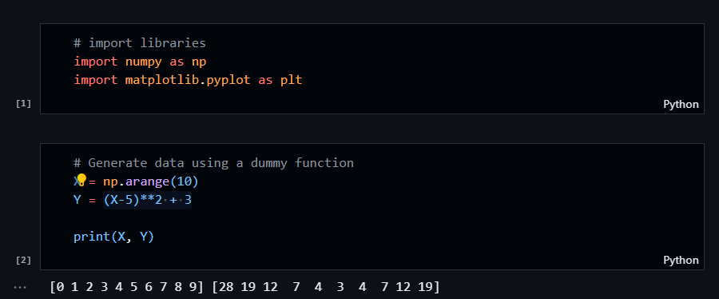

**Step 3: Plot a Graph for these value**

```Python
plt.style.use('seaborn-v0_8-whitegrid')
plt.plot(X, Y)
plt.xlabel('X')
plt.ylabel('Y')
plt.show()
```

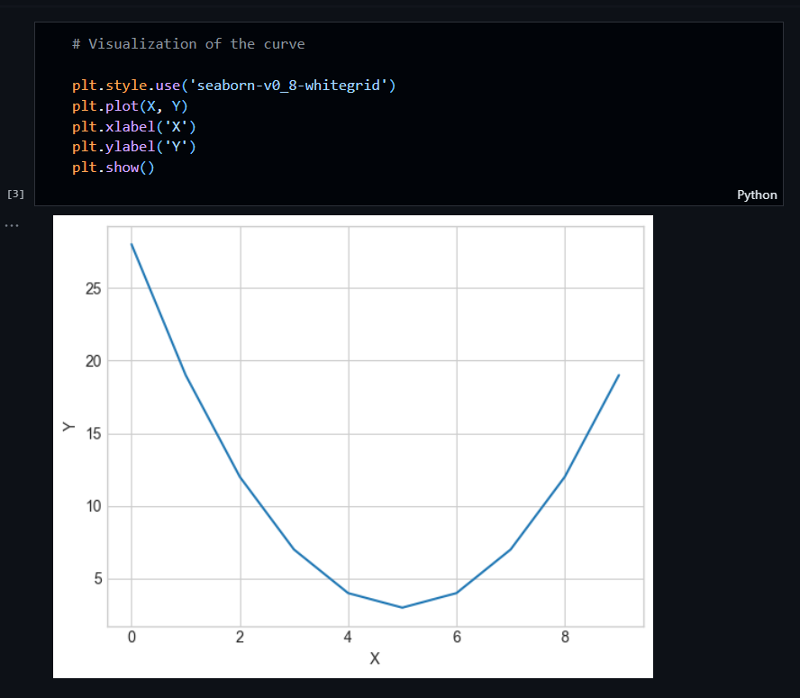

**Step 4: Perform Gradient Descent Optimization**

```python
# Gradient Descent when slope/gradient is negative
# Initialize x with any random value
x = 0
# Learning rate (lr)
lr = 0.1

# Plot X and Y
plt.plot(X, Y)

for i in range(50):
	# let's define the dy/dx or slope or we said it as gradient which is differenciation of y = f(x)
	gradient = 2 * (x - 5) 

	# Update in value of x
	x = x - lr * gradient
	# Value of y w.r.t x (small x)
	y = (x - 5) ** 2 + 3

	# plotting data points in scatter points
	plt.scatter(x, y)

	print(x)

plt.show()

```

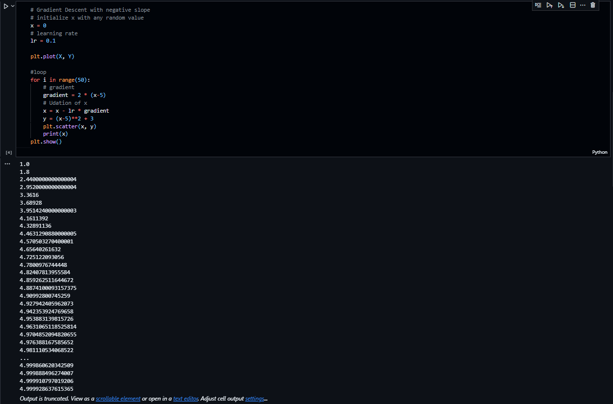

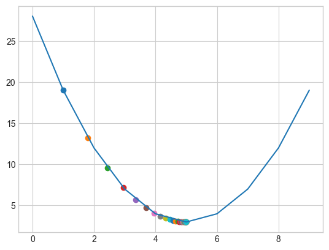

 **Step 5:** **Performing Gradient Descent when slope is positive slope**

```python
# Gradient Descent when slope/gradient is positive
# Initialize x with any random value
x = 9
# Learning rate (lr)
lr = 0.1

# Plot X and Y
plt.plot(X, Y)

for i in range(50):
	# let's define the dy/dx or slope or we said it as gradient which is differenciation of y = f(x)
	gradient = 2 * (x - 5) 

	# Update in value of x
	x = x - lr * gradient
	# Value of y w.r.t x (small x)
	y = (x - 5) ** 2 + 3

	# plotting data points in scatter points
	plt.scatter(x, y)

	print(x)

plt.show()
```

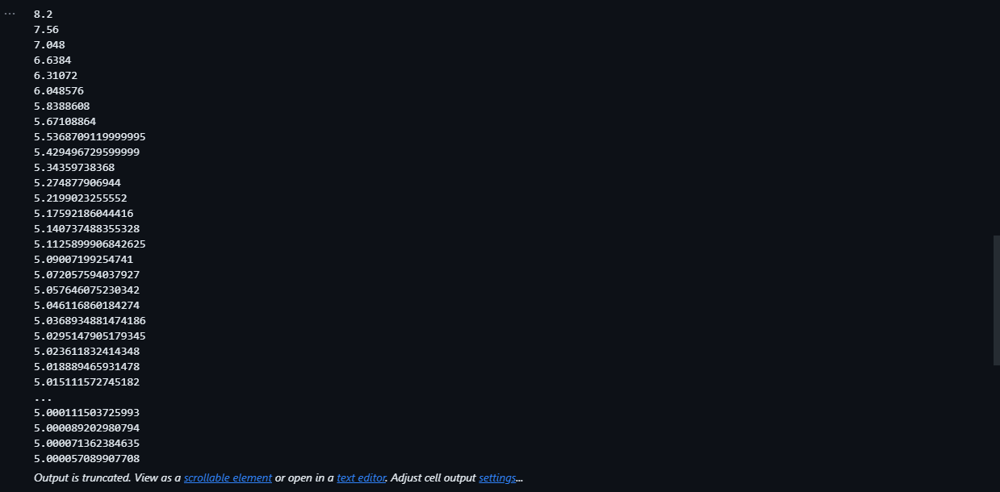

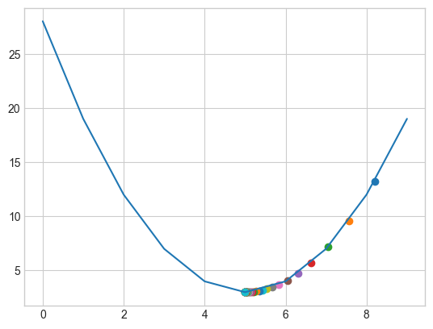

- If there is a function $f(x)$ and we want the minimum value of $f(x)$ we using this optimization algorithm
- Starting with any random value of $x$, then updation of that value of $x$ and then, It will converge upto the local minima.
- The Cost function $J(\Theta)$ in linear regression, it have only one minima so, that lacal minima is considered as the global minima since, the goal of this optimization is to reach the global minima.

$J(\Theta)$ = J($\Theta_{0}, \Theta_{1})$ = $\frac{1}{2m} \Sigma_{i=1}^m ( h_{\Theta}^{i}(x) - {y}^{i} )^2$

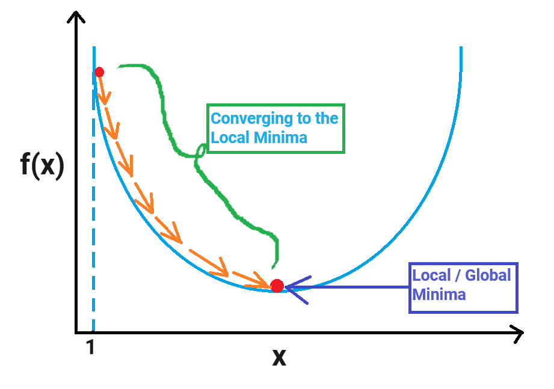


