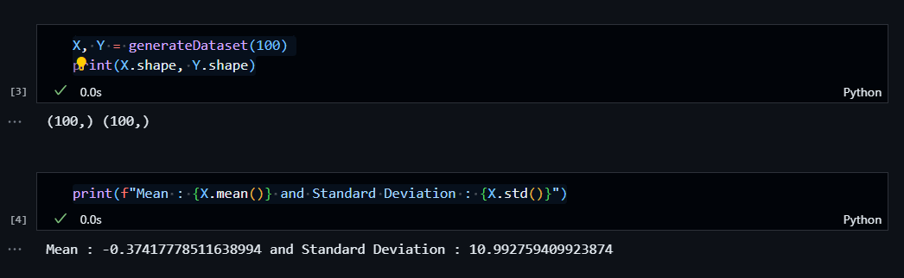

# Linear Regression

- Linear Regression is also known as **Ordinary Least Squares.**
- Regression predicts a **countinuous value**. Now we will build an algorithm that solves the task of predicting marks given a labelled dataset.
- The goal of the algorithm is to learn a **linear model** that predicts a ***y** for an unseen **x** with minimum error*.

  **Input (X) :** It is the independent feature or **input feature** which is **Time Spent**.

  **Output (Y) :** It is the dependent feature (or) the **target** variable which is **Marks**.


#### Equation of Line: Y = m * x + c

where, m is the slope, c is the intercept and x is the coefficient.


## Hypothesis

**Step 1: Assume a Hypothesis function**

- Linear Regression is a **parametric method**, which means it makes an assumption about the form of the function relating X and Y. So, we decide to approximate **y** as a linear function of **x**

  

**Step 2: Decide Loss/Error Function**

- Given a training set. how do we learn, the best values for the parameters ***θ***, so we define an error function that measures for each value of ***θ*** how close the predictions are to the actual **y** values.

**Loss Function:** The loss function is a measure of how close we are to the true/target value or in general, it is a measure of how good the algorithm is doing. The lower the loss the better our predictions will be.

**J(***θ***) = $\frac{1}{2m} \Sigma_{i=1}^m ( {y}-\hat{y} )^2$**

(OR)

J($\Theta_{0}, \Theta_{1})$ = $\frac{1}{2m} \Sigma_{i=1}^m ( {y}^{i}-h_{\Theta}^{i}(x) )^2$


Here in above diagram we can see the Line L1 is better as compare to Line L2 because the distance/error/residual from actual datapoint from the prediction lines L1 & L2 is lesser in comparison.

**Absolute Error :** The absolute error, denoted as **|𝑦 − 𝑦̂|**, measures the absolute difference between the actual value **(𝑦)** and the predicted or estimated value **(𝑦̂)**. It quantifies the magnitude of the error without considering its direction. The formula for absolute error is: **∣𝑦−𝑦̂∣** and Total absolute error will be:

**Total Absolute error = $\Sigma_{i=1}^m  | {y}-\hat{y} |$**

**Sum of Squared Error (SSE) :** The Sum of Squared Error (SSE) is a metric used to quantify the overall discrepancy between the actual data points and the values predicted by a model. It is calculated by taking the sum of the squared differences between each actual data point and its corresponding predicted value. The formula for SSE can be expressed as:

**𝑆𝑆𝐸 = $\Sigma_{i=1}^m ( {y}-\hat{y} )^2$**

**Mean Square Error (MSE) :** The mean square error, often denoted as MSE, is a metric that calculates the average of the squares of the errors between the actual and predicted values. It is represented by the formula:

**𝑀𝑆𝐸 = $\frac{1}{m} \Sigma_{i=1}^m ( {y}-\hat{y} )^2$**

Here, m represents the number of data points, $ y_{i}$ denotes the actual values, and $\hat y_{i}$ represents the predicted values.

**We Prefer MSE Over Absolute Error:**

* **MSE penalizes larger errors more significantly** due to the squaring operation, providing a more accurate representation of the model's performance.

  
* It is "**differentiable"** and exhibits some desirable mathematical properties, making it convenient for optimization algorithms.

**Step 3: Training - an algorithm that reduces error on training data**

- Starting with a random $\Theta$, we need an algorithm that iteratively improves $\Theta$ by reducing $J(\Theta)$ in each step and converges eventually to minimum error.
- Task: find the parameters that minimize loss, i.e. make our model as accurate as possible.

### Gradient Descent

- The **gradient descent algorithm is an optimization technique used to minimize the cost function by iteratively adjusting the model parameters**.
- To efficiently perform this optimization, it requires the **cost function to be differentiable**.
- The differential function allows the algorithm to calculate the gradient, indicating the direction and magnitude of the steepest ascent or descent. Without a differentiable cost function, the algorithm cannot determine the appropriate direction for parameter updates, hindering its convergence towards the optimal solution.

  
- MSE is preferred over absolute error due to **its enhanced sensitivity to larger errors and mathematical properties**, while a differential function is essential for the gradient descent algorithm to **iteratively optimize the model parameters** in a differentiable cost function.

Let's code Gradient Descent in python using a quadratic function

$y = f(x) = (x - 5)^2 + 3$

**Step 1: Import the necessary libraries**

```python
import numpy as np
import matplotlib.pyplot as plt
```

**Step 2: Get data for X and Y**

```python
# Generate data using a dummy function
X = np.arange(10)
Y = (X - 5)**2 + 3

print(X, Y)
```


**Step 3: Plot a Graph for these value**

```Python
plt.style.use('seaborn-v0_8-whitegrid')
plt.plot(X, Y)
plt.xlabel('X')
plt.ylabel('Y')
plt.show()
```


**Step 4: Perform Gradient Descent Optimization**

```python
# Gradient Descent when slope/gradient is negative
# Initialize x with any random value
x = 0
# Learning rate (lr)
lr = 0.1

# Plot X and Y
plt.plot(X, Y)

for i in range(50):
	# let's define the dy/dx or slope or we said it as gradient which is differenciation of y = f(x)
	gradient = 2 * (x - 5) 

	# Update in value of x
	x = x - lr * gradient
	# Value of y w.r.t x (small x)
	y = (x - 5) ** 2 + 3

	# plotting data points in scatter points
	plt.scatter(x, y)

	print(x)

plt.show()

```


 **Step 5:** **Performing Gradient Descent when slope is positive slope**

```python
# Gradient Descent when slope/gradient is positive
# Initialize x with any random value
x = 9
# Learning rate (lr)
lr = 0.1

# Plot X and Y
plt.plot(X, Y)

for i in range(50):
	# let's define the dy/dx or slope or we said it as gradient which is differenciation of y = f(x)
	gradient = 2 * (x - 5) 

	# Update in value of x
	x = x - lr * gradient
	# Value of y w.r.t x (small x)
	y = (x - 5) ** 2 + 3

	# plotting data points in scatter points
	plt.scatter(x, y)

	print(x)

plt.show()
```


- If there is a function $f(x)$ and we want the minimum value of $f(x)$ we using this optimization algorithm
- Starting with any random value of $x$, then updation of that value of $x$ and then, It will converge upto the local minima.
- The Cost function $J(\Theta)$ in linear regression, it have only one minima so, that lacal minima is considered as the global minima since, the goal of this optimization is to reach the global minima.

$J(\Theta)$ = J($\Theta_{0}, \Theta_{1})$ = $\frac{1}{2m} \Sigma_{i=1}^m ( h_{\Theta}^{i}(x) - {y}^{i} )^2$


parameters $(\Theta)$ = [$\Theta_{0}, \Theta_{1}]$


 **Mathematics behind Gradient Descent**

Gradient Descent Convergence formula:

$\Theta_{j+1} $ := $\Theta_{j}$ - $\alpha * \frac{\partial}{\partial \theta} J(\theta) $

* $\theta_{j+1}$  represents the updated value of the parameter at iteration ( j +1) of new value
* $\theta_j $ represents the current value of the parameter at iteration ( j )
* $\alpha $ represents the learning rate
* $\frac{\partial}{\partial \theta} J(\theta) $ represents the partial derivative of the cost function ( $J(\theta)$ ) with respect to the parameter ( $\theta$ )

In simple terms: parameter = parameter - LR * partial derivative of Loss w.r.t parameter


A **partial derivative** $\frac{\partial}{\partial \theta} J(\theta)$  indicates how much total loss is increased (or) decreased if you increase $\Theta$ parameter by small amount.

### Implementation of Linear Regression

**Step1: Import Required Libraries**

```python
# Importing required Libraries
import numpy as np
import matplotlib.pyplot as plt
plt.style.use('seaborn-v0_8-whitegrid')
```

Let's assume a linear function $Y = f(x)$, where $f(x$) = 3 * X + 1 + (noise) is a linear function.

**Step 2: Data Generation**

```python
def generateDataset(m):  
	# array of X  
	X     = np.random.randn(m) * 10  
	noise = np.random.randn(m) * 5  
	Y     = 3 * X + 1 + noise  
        return X, Y
```


`def generateDataset(m):` - This line defines a function named `generateDataset` that takes one parameter `m`.

`X = np.random.randn(m) * 10` - This line generates an array of random numbers following a standard normal distribution with mean 0 and standard deviation 1, using `np.random.randn(m)`, and then scales these numbers by 10 to create an array `X`. This array represents the input variable X in a dataset.

`noise = np.random.randn(m) * 5` - This line generates another array of random numbers following a standard normal distribution, this time scaled by 5 to create a noise array that represents random noise in the dataset.

`Y = 3 * X + 1 + noise` - This line calculates the output variable `Y` using a linear relationship with `X`, a constant term `1`, and the noise. Basically, it's a linear relationship with

some added noise.

`return X, Y` - This line returns the arrays `X` and `Y` as the output of the function.

The `np.random.randn()` function is used here to generate random numbers that follow a standard normal distribution. In statistics, the standard normal distribution has a mean ($\mu$) of 0 and a standard deviation($\sigma$) of 1, and generating random numbers from a standard normal distribution is used to simulate real-world scenarios where many natural phenomena tend to follow a normal distribution. Additionally, using a standard normal distribution simplifies the modeling process and allows for straightforward easier interpretation of the generated dataset.


```python
# Calling generateDataset() function and distribution of data along X and Y printing shape of X and Y.
X, Y = generateDataset(100)
print(X.shape, Y.shape)

# Mean and Standard Deviation
print(f"Mean : {X.mean()} and Standard Deviation : {X.std()}")
```



**Step 3: Visualization of Generated data**

```python
def plotData(X, Y, color="orange", title="Data"):
    plt.xlabel('Marks')
    plt.ylabel('Work Efficiency')
    plt.scatter(X, Y, color=color)
    plt.title(title)
    plt.show()
  
plotData(X, Y)
```

Let Y = Work Efficiency and X = Marks just assume then the plot looks like below Plot:


