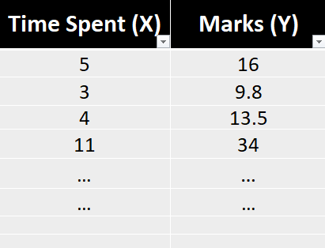

# Linear Regression

- Linear Regression is also known as **Ordinary Least Squares.**
- Regression predicts a **countinuous value**. Now we will build an algorithm that solves the task of predicting marks given a labelled dataset.
- The goal of the algorithm is to learn a **linear model** that predicts a ***y** for an unseen **x** with minimum error*.

  **Input (X) :** It is the independent feature or **input feature** which is **Time Spent**.

  **Output (Y) :** It is the dependent feature (or) the **target** variable which is **Marks**.

#### Equation of Line: Y = m * x + c

where, m is the slope, c is the intercept and x is the coefficient.

## Hypothesis

**Step 1: Assume a Hypothesis function**

- Linear Regression is a **parametric method**, which means it makes an assumption about the form of the function relating X and Y. So, we decide to approximate **y** as a linear function of **x**

  

**Step 2: Decide Loss/Error Function**

- Given a training set. how do we learn, the best values for the parameters ***θ***, so we define an error function that measures for each value of ***θ*** how close the predictions are to the actual **y** values.

**Loss Function:** The loss function is a measure of how close we are to the true/target value or in general, it is a measure of how good the algorithm is doing. The lower the loss the better our predictions will be.

**J(***θ***) = $\frac{1}{m} \Sigma_{i=1}^m ( {y}-\hat{y} )^2$**

(OR)

J($\Theta_{0}, \Theta_{1})$ = $\frac{1}{m} \Sigma_{i=1}^m ( {y}^{i}-h_{\Theta}^{i}(x) )^2$

Here in above diagram we can see the Line L1 is better as compare to Line L2 because the distance/error/residual from actual datapoint from the prediction lines L1 & L2 is lesser in comparison. 

**Absolute Error :** The absolute error, denoted as **|𝑦 − 𝑦̂|**, measures the absolute difference between the actual value **(𝑦)** and the predicted or estimated value **(𝑦̂)**. It quantifies the magnitude of the error without considering its direction. The formula for absolute error is: **∣𝑦−𝑦̂∣** and Total absolute error will be:

**Total Absolute error = $\Sigma_{i=1}^m  | {y}-\hat{y} |$**

**Sum of Squared Error (SSE) :** The Sum of Squared Error (SSE) is a metric used to quantify the overall discrepancy between the actual data points and the values predicted by a model. It is calculated by taking the sum of the squared differences between each actual data point and its corresponding predicted value. The formula for SSE can be expressed as:

**𝑆𝑆𝐸 = $ \Sigma_{i=1}^m ( {y}-\hat{y} )^2$**

**Mean Square Error (MSE) :** The mean square error, often denoted as MSE, is a metric that calculates the average of the squares of the errors between the actual and predicted values. It is represented by the formula:

**𝑀𝑆𝐸=$\frac{1}{m} \Sigma_{i=1}^m ( {y}-\hat{y} )^2$**

Here, m represents the number of data points, $ y_{i}$ denotes the actual values, and $\hat y_{i}$ represents the predicted values.

**We Prefer MSE Over Absolute Error:**

* **MSE penalizes larger errors more significantly** due to the squaring operation, providing a more accurate representation of the model's performance.

  
* It is "**differentiable"** and exhibits some desirable mathematical properties, making it convenient for optimization algorithms.
